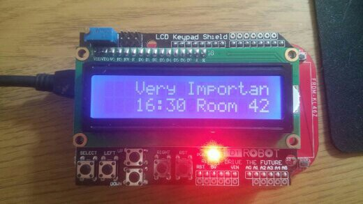

# mbed_lcd_hid

## Overview

Display notifications received via [USB HID](https://en.wikipedia.org/wiki/USB_human_interface_device_class) on an [mbed](http://mbed.org) connected LCD

The mbed board acts as a HID meaning that no special USB drivers are required.  The host PC is then able to send messages to the mbed board in order to display text on the LCD.

Currently implemented features:
* Scrolling of messages too long to fit on the display
* Pause before scrolling to allow start of message to be read
* Pulsing of LCD for new messages, cancelled via a swipe of the position sensor
* Configurable LCD contrast (via the "up" and "down" buttons on the LCD shield)

## Uses

I'm using it along with [ReminderNotifier](https://github.com/bright-tools/ReminderNotifier) to display Outlook reminders, as on a multi-monitor display I find that the native Outlook reminder dialog just gets lost/overlooked (particularly with the recent behaviour whereby the Window does not always pop to the front).

## Kit

I'm using:
* [NXP FRDM-KL46Z](https://developer.mbed.org/platforms/FRDM-KL46Z/)
* [Robot LCD Shielf](https://www.dfrobot.com/product-51.html)
